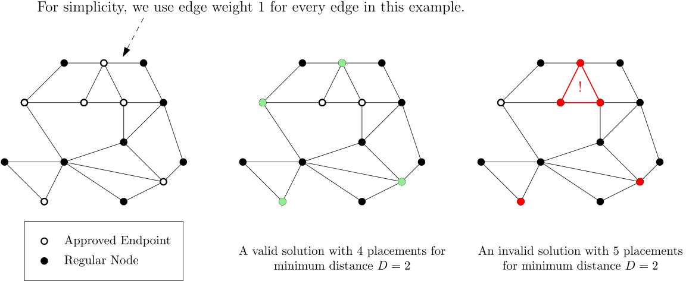
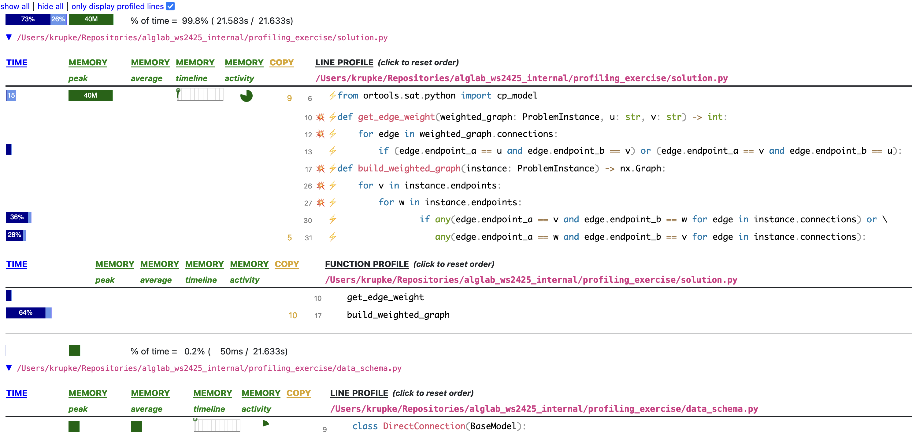

# Learn to Use Scalene to Find Bottlenecks in Your Python Code and NetworkX to Solve Graph Problems

In this exercise, you do not need to write a new solver from scratch. Instead, I
have provided a solver for you. Unfortunately, it is not very efficient. The
problem is provably NP-hard, and as a result, CP-SAT can take a significant
amount of time. However, my assistant informed me that the solver itself is not
the main issue and suggested that the bottleneck might be elsewhere in the code.

Interestingly, the assistant claimed to have fixed the code with just a few
lines of adjustments but then vanished on a three-year vacation. Your task is to
discover what solution the assistant might have had in mind and to solve all the
given instances in less than 30 seconds.

|                                       **Prerequisites**                                       |
| :-------------------------------------------------------------------------------------------: |
| - Understanding of basic graph theory concepts, as covered in Algorithms and Data Structures. |
|          - Familiarity with CP-SAT and the OR-Tools library from the first exercise.          |
|           - Knowledge of how to use the `verify.py` script from the first exercise.           |

The problem involves working with graphs, so let us first explore how to handle
graphs in Python using the NetworkX library. Afterwards, we will look at the
problem we are trying to solve and the current implementation. Finally, we will
use Scalene to profile the code and identify bottlenecks.

## NetworkX Tutorial

NetworkX is a Python package specifically designed for working with networks,
also known as graphs. It allows not only to easily create and manipulate graphs
but also to perform complex graph algorithms. NetworkX is widely utilized across
various disciplines incorporating network analysis, such as social network
analysis and bioinformatics.

### Installation

You can install NetworkX using pip:

```bash
pip install networkx
```

### Creating a Graph

Start by importing NetworkX and creating a new graph object:

```python
import networkx as nx

G = nx.Graph()
```

### Adding Nodes

Nodes can be added individually using
[`add_node`](https://networkx.github.io/documentation/stable/reference/classes/generated/networkx.Graph.add_node.html#networkx.Graph.add_node):

```python
# Adding nodes "A", "B", "C"
G.add_node("A")
G.add_node("B")
G.add_node("C")

# Various objects can be used as nodes; from 'int' and 'str' to other objects and custom classes!
G.add_node(42)  # Integer
G.add_node(3.14)  # Floating-point number
G.add_node(True)  # Boolean
G.add_node(1 + 2j)  # Complex number
G.add_node(frozenset([1, 2, 3]))  # Frozen set
G.add_node(datetime.date(2020, 1, 1))  # Date
G.add_node(MyClass())  # Instance of custom class
```

Multiple nodes can be added at once using
[`add_nodes_from`](https://networkx.github.io/documentation/stable/reference/classes/generated/networkx.Graph.add_nodes_from.html#networkx.Graph.add_nodes_from):

```python
G.add_nodes_from(["D", "E", "F"])  # Using a list of nodes
G.add_nodes_from({4, 5, 6})  # Using a set of nodes
```

Nodes can have attributes as well:

```python
G.add_node("G", size=3)
G.add_node("H", size=4)
G.add_node("I", size=5)
```

These attributes can be accessed using the
[`nodes`](https://networkx.github.io/documentation/stable/reference/classes/generated/networkx.Graph.nodes.html#networkx.Graph.nodes)
attribute:

```python
print(G.nodes["G"]["size"])
```

### Adding Edges

Edges can be added individually using
[`add_edge`](https://networkx.github.io/documentation/stable/reference/classes/generated/networkx.Graph.add_edge.html#networkx.Graph.add_edge):

```python
G.add_edge("A", "B")
G.add_edge("B", "C")
G.add_edge("C", "A")
```

Edges can also have weights:

```python
G.add_edge("A", "B", weight=3)
G.add_edge("B", "C", weight=4)
G.add_edge("C", "A", weight=5)
```

### Accessing Nodes and Edges

You can access the nodes and edges of a graph using
[`nodes`](https://networkx.github.io/documentation/stable/reference/classes/generated/networkx.Graph.nodes.html#networkx.Graph.nodes)
and
[`edges`](https://networkx.github.io/documentation/stable/reference/classes/generated/networkx.Graph.edges.html#networkx.Graph.edges):

```python
print(G.nodes)
print(G.edges)
```

To get the neighbors of a node, use
[`neighbors`](https://networkx.github.io/documentation/stable/reference/classes/generated/networkx.Graph.neighbors.html#networkx.Graph.neighbors):

```python
print(list(G.neighbors("A")))
```

To access the attributes of a node or edge, use the
[`nodes`](https://networkx.github.io/documentation/stable/reference/classes/generated/networkx.Graph.nodes.html#networkx.Graph.nodes)
and
[`edges`](https://networkx.github.io/documentation/stable/reference/classes/generated/networkx.Graph.edges.html#networkx.Graph.edges)
attributes:

```python
print(G.nodes["A"])
print(G.edges[("A", "B")])
```

For example, to read the weight of an edge:

```python
print(G.edges[("A", "B")]["weight"])
```

To check if two nodes are connected, use the
[`has_edge`](https://networkx.github.io/documentation/stable/reference/classes/generated/networkx.Graph.has_edge.html#networkx.Graph.has_edge)
method:

```python
print(G.has_edge("A", "B"))
```

### Algorithms

NetworkX includes numerous algorithms for graph analysis. For instance, to find
the shortest path between two nodes, use
[`shortest_path`](https://networkx.github.io/documentation/stable/reference/algorithms/generated/networkx.algorithms.shortest_paths.generic.shortest_path.html#networkx.algorithms.shortest_paths.generic.shortest_path):

```python
print(nx.shortest_path(G, "A", "C"))
```

To find the minimum spanning tree of a graph, use
[`minimum_spanning_tree`](https://networkx.github.io/documentation/stable/reference/algorithms/generated/networkx.algorithms.tree.mst.minimum_spanning_tree.html#networkx.algorithms.tree.mst.minimum_spanning_tree):

```python
T = nx.minimum_spanning_tree(G)
```

To iterate over all connected components, use
[`connected_components`](https://networkx.github.io/documentation/stable/reference/algorithms/generated/networkx.algorithms.components.connected_components.html#networkx.algorithms.components.connected_components):

```python
for component in nx.connected_components(G):
    print(component)
```

### Further Information

For more detailed information and additional capabilities of NetworkX, you can
refer to the
[official documentation](https://networkx.github.io/documentation/stable/).

- An introductory overview is available
  [here](https://networkx.github.io/documentation/stable/reference/introduction.html).
- A comprehensive list of available algorithms can be found
  [here](https://networkx.github.io/documentation/stable/reference/algorithms/index.html).

This tutorial should help you get started with NetworkX quickly and efficiently.
Enjoy working with your graphs!

## Problem Motivation and Description

Now that we know how to use NetworkX, let us look at the problem we are trying
to solve. In modern network design, ensuring efficient and robust connectivity
between various nodes is critical. This is particularly significant in contexts
such as telecommunications, data center management, and distributed computing
systems. One common challenge is to maximize the placement of key network
components (e.g., routers, servers, or sensors) in a way that optimizes network
performance while adhering to certain constraints. This problem is crucial
because optimal placement directly influences network reliability, latency, and
overall operational efficiency.

### Problem Description

We are given a network represented by a set of endpoints and direct connections
between them. The objective is to maximize the number of placements of critical
network components at approved endpoints while ensuring that the minimum
distance between any two placements is respected. This problem can be formally
described as follows:

- **Endpoints**: A list of nodes in the network where each node represents a
  possible location for placing a network component.
- **Connections**: A list of direct, undirected connections between endpoints.
  Each connection has an associated distance, indicating the physical or logical
  separation between the two endpoints.
- **Approved Endpoints**: A subset of endpoints that are eligible for placement
  of the network components.
- **Minimum Distance Constraint**: A minimum required distance between any two
  placements to prevent interference and ensure optimal performance.
- **Distance Definition**: The distance between any two endpoints is defined as
  the shortest connection path in the network.

### Formal Definitions

1. **Endpoints (V)**: A list $V = \{v_1, v_2, \ldots, v_n\}$ where each $v_i$ is
   a node in the network.
2. **Connections (E)**: A list $E = \{e_1, e_2, \ldots, e_m\}$ where each
   $e_i = (v_{a_i}, v_{b_i}, d_i)$ represents a direct connection between
   endpoints $v_{a_i}$ and $v_{b_i}$ with distance $d_i$. The network is
   undirected, so $(v_{a_i}, v_{b_i})$ is identical to $(v_{b_i}, v_{a_i})$.
3. **Approved Endpoints (W)**: A list $W \subseteq V$ of endpoints approved for
   placement.
4. **Minimum Distance (D)**: An integer $D$ representing the minimum distance
   required between any two placements.
5. **Shortest Distance**: The distance between any two endpoints is defined by
   the shortest path connecting them in the network, computed using the sum of
   the distances of the direct connections along the path.

#### Objective

The goal is to determine the maximum number of placements at approved endpoints
such that the distance between any two placements is at least $D$. This involves
selecting a subset $P \subseteq W$ where $P = \{p_1, p_2, \ldots, p_k\}$ that
maximizes $k$, subject to the constraint that for any two placements
$p_i, p_j \in P$, the distance $d(p_i, p_j)$ (measured as the shortest path in
the network) is at least $D$.

### Example

To get a better idea of the problem, consider the graph in the following
example. For reasons of simplicity this graph has uniform edge weights with
$\forall \{u,v\} \in E: d(u,v) = 1$. The graph instance is shown on the left and
the approved endpoints $W$ are highlighted. These can be seen as _candidates_
for placement of the resources/equipment. Remember that $D \in \mathbb{R}$
defines the minimum shortest path distance required between each two placements.



In the middle a valid solution to the problem for $D=2$ is shown. This solution
fits $4$ placements into the set of approved endpoints while obeying the minimum
shortest path distance constraint. In contrast, the solution shown on the right
is invalid for $D=2$. As can be seen, this invalid solution contains three
neighboring placements that all have shortest path distances of $1 < D$ in
between them, which violates the constraints of the problem.

### Data Format

The input and output formats are specified in the solution.py file. To
facilitate the easy import and export of data—an important aspect when
integrating the algorithm into a larger system—we use Pydantic models. Pydantic
ensures data validation and integrity by automatically checking types and
values, and it also simplifies data parsing, serialization, and deserialization.
This makes your code more robust and easier to maintain. Familiarity with
Pydantic is not required; simply follow the usage examples provided in the
solution.py file.

```python
# pip install pydantic
from pydantic import BaseModel, Field


class DirectConnection(BaseModel):
    """
    A direct connection between two endpoints in the network.
    As the network is undirected, the order of the endpoints does not matter.
    The network, thus, should not contain both (A, B) and (B, A), as they are the same connection.
    """

    endpoint_a: str = Field(
        ...,
        description="The first endpoint in the connection. As the order does not matter, it can be swapped with endpoint_b.",
    )
    endpoint_b: str = Field(
        ...,
        description="The second endpoint in the connection. As the order does not matter, it can be swapped with endpoint_a.",
    )
    distance: int = Field(..., description="The distance between the two endpoints.")


class ProblemInstance(BaseModel):
    """
    Represents a problem instance of the network placement problem.
    """

    endpoints: list[str] = Field(..., description="A list of endpoints in the network.")
    connections: list[DirectConnection] = Field(
        ..., description="A list of direct connections between endpoints."
    )
    approved_endpoints: list[str] = Field(
        ..., description="A list of endpoints that are approved for placement."
    )
    min_distance_between_placements: int = Field(
        ..., description="The minimum distance between any two placements."
    )


class Solution(BaseModel):
    """
    Represents a solution to the network placement problem.
    """

    selected_placements: list[str] = Field(
        ...,
        description="A list of endpoints that are selected for placement. Have to be a subset of approved_endpoints.",
    )
```

### Current Implementation

You can find the current implementation in the `solution.py` file.

```python
import itertools

# pip install networkx
import networkx as nx

# pip install ortools
from ortools.sat.python import cp_model

from data_schema import ProblemInstance, Solution


def get_edge_weight(weighted_graph: ProblemInstance, u: str, v: str) -> int:
    """Retrieve the weight of the edge between two nodes."""
    for edge in weighted_graph.connections:
        if (edge.endpoint_a == u and edge.endpoint_b == v) or (
            edge.endpoint_a == v and edge.endpoint_b == u
        ):
            return edge.distance
    raise KeyError(f"Edge {u} - {v} not found in the graph")


def build_weighted_graph(instance: ProblemInstance) -> nx.Graph:
    """Build a NetworkX graph from the problem instance so we can use its shortest path implementation."""
    G = nx.Graph()

    # Add all endpoints as nodes in the graph
    for vertex in instance.endpoints:
        G.add_node(vertex)

    # Add edges with weights to the graph
    for v in instance.endpoints:
        for w in instance.endpoints:
            if v != w:  # Ensure not to check the same node
                # Check if there is an edge between v and w
                if any(
                    edge.endpoint_a == v and edge.endpoint_b == w
                    for edge in instance.connections
                ) or any(
                    edge.endpoint_a == w and edge.endpoint_b == v
                    for edge in instance.connections
                ):
                    # Get the weight of the edge and add it to the graph
                    weight = get_edge_weight(instance, v, w)
                    G.add_edge(v, w, weight=weight)

    return G


def distance(instance: ProblemInstance, u: str, v: str) -> int:
    """Calculate the shortest path distance between two endpoints in the network."""
    graph = build_weighted_graph(instance)
    return nx.shortest_path_length(graph, u, v, weight="weight")


class MaxPlacementsSolver:
    """
    A solver for the maximum number of placements problem using Google OR-Tools' CP-SAT solver.
    """

    def __init__(self, instance: ProblemInstance):
        self.instance = instance
        self.model = cp_model.CpModel()

        # Create a boolean variable for each approved endpoint
        # It will be True if the (approved) endpoint is selected, False otherwise
        self.vars = {
            endpoint: self.model.NewBoolVar(endpoint)
            for endpoint in instance.approved_endpoints
        }

        # Add constraints and objective to the model
        self._add_distance_constraints()
        self._set_objective()

    def _add_distance_constraints(self):
        """Add constraints to ensure selected endpoints are not too close."""
        for endpoint1, endpoint2 in itertools.combinations(
            self.instance.approved_endpoints, 2
        ):
            if (
                distance(self.instance, endpoint1, endpoint2)
                < self.instance.min_distance_between_placements
            ):
                self.model.Add(self.vars[endpoint1] + self.vars[endpoint2] <= 1)

    def _set_objective(self):
        """Set the objective to maximize the number of selected endpoints."""
        self.model.Maximize(sum(self.vars.values()))

    def solve(self, time_limit: float = 10) -> Solution:
        """Solve the optimization problem within the given time limit."""
        solver = cp_model.CpSolver()
        solver.parameters.max_time_in_seconds = time_limit
        # Enable logging to stdout so we can see the progress
        solver.parameters.log_search_progress = True
        solver.parameters.log_to_stdout = True

        # Solve the model
        status = solver.Solve(self.model)

        # Return the solution if one was found (either optimal or at least feasible)
        if status in (cp_model.OPTIMAL, cp_model.FEASIBLE):
            # Retrieve the selected endpoints by querying the value of the variables
            selected_placement = [
                endpoint for endpoint in self.vars if solver.Value(self.vars[endpoint])
            ]
            return Solution(selected_placement=selected_placement)

        raise RuntimeError("No solution found within the time limit.")
```

Let us quickly go through the code:

1. **Calculating Distances:** A crucial part of the problem is calculating the
   distances between two potential placements, as they are not explicitly given.
   For this, we use NetworkX.

2. **Building the Graph:** To use NetworkX, we first build a weighted graph from
   the given problem instance. This is done in the `build_weighted_graph`
   function.

3. **Extracting Edge Weights:** To build the graph, we need to extract the
   weights of the direct connections from the instance. This is handled by the
   `get_edge_weight` function.

4. **Calculating Shortest Path:** With the graph built, we write the `distance`
   function to calculate the shortest path distance between two endpoints in the
   network using NetworkX's shortest path algorithms.

5. **Creating the Solver:** We then build a solver that has a boolean variable
   for each possible location. The solver ensures that two placements are not
   too close to each other by iterating over all pairs of placements and adding
   a constraint if they are too close.

6. **Setting the Objective:** The objective is to maximize the number of
   selected placements, which essentially is the sum of all boolean variables.

7. **Solving the Problem:** Finally, we start the solver and return the selected
   placements.

This code sets up the problem, builds the necessary graph structures, and uses
optimization techniques to find the best placement solutions. To identify and
fix performance bottlenecks, we can use Scalene for profiling.

## Profiling with Scalene

When you run the code for `instance_30.json` and `instance_50.json`, you may
notice that while the code completes, it takes a significant amount of time.
Supposedly, even the `instance_500.json` was solved in less than 10 seconds
after the assistant's changes. To find performance bottlenecks, you can use
Scalene to profile the code.

Scalene is a highly accurate and easy-to-use Python profiler. You can install
Scalene using pip:

```bash
pip install scalene
```

To profile the code, you can run Scalene with the following command:

```bash
python -m scalene --html --program-path . --output --- profile.html YOUR_SCRIPT.py
```

For example, you could check the instance `instance_50.json` with the following
command:

```bash
python -m scalene --html --program-path . --output profile.html verify.py instance_50
```

(this will take a while with the current implementation if you have not fixed it
yet.)

This command will run the `solution.py` script and generate a Scalene profile in
HTML format. The `--program-path .` will only measure the time for your own
code. Usually, Scalene will open the profile in your default browser
automatically. If it does not, you can open the `profile.html` file manually.
The profile may look like this:

|  |
| :-----------------------------------------------: |
|             _Example Scalene Profile_             |

The profile will show, for each file, how much time was attributed to (A) each
line and (B) each function. In this example, Line 30 of `solution.py` seems to
take 36% of the time, and the function `build_weighted_graph` takes 64%. Lines
that do not contribute significantly to the runtime are not shown in the profile
to keep it clean.

By analyzing the Scalene profile, you can identify which parts of your code are
the most time-consuming and focus your optimization efforts on those areas.

## Tasks

Now it is your turn to optimize the code. Follow these steps to improve the
performance of the solver:

1. Familiarize yourself with the current implementation in `solution.py` and the
   data format in `data_schema.py`.
2. Find the bottleneck in the current implementation using Scalene.
3. Optimize the code in `solution.py` to make it sufficiently fast for the given
   instances.
4. Verify your solution using the `verify.py` script. You can run it with
   `python3 verify.py`.
5. If your code is still too slow for the larger instances, iterate on your
   optimization until it is fast enough. You can run individual instances with
   `python3 verify.py instance_30`, `python3 verify.py instance_50`, and
   `python3 verify.py instance_500`. Analogue for the Scalene profiling, e.g.,
   `python -m scalene --html --program-path . --output profile.html verify.py instance_50`.

## References

- [pydantic](https://docs.pydantic.dev/latest/): Make yourself familiar with the
  abilities of `pydantic` to ensure valid data. While there are many similar
  libraries, including Python's own `dataclasses`, `pydantic` is a very popular
  choice for data validation and serialization in industry.
- [CP-SAT Primer](https://github.com/d-krupke/cpsat-primer): A primer by us for
  CP-SAT.
- [NetworkX Documentation](https://networkx.github.io/documentation/stable/):
  The official documentation for NetworkX.
- [Scalene](https://github.com/plasma-umass/scalene): The Scalene GitHub
  repository. You are of course also free to use other profilers, but Scalene is
  a pretty good choice for Python.
