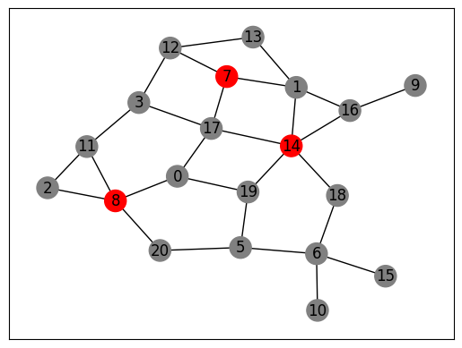

# Exercise Sheet 03: (Cardinality-) Satisfiability with SAT-Solvers

_Algorithms Lab Winter 2024/2025 - Dr. Dominik Krupke, TU Braunschweig, IBR,
Algorithms Group_

Constraint Programming allows us to declaratively describe our problem and let
the computer handle it. This time, we will do all the encoding and optimizing
ourselves, and only use a simple
[SAT-solver](https://en.wikipedia.org/wiki/SAT_solver). You probably already
know the
[Cook-Levin Theorem](https://en.wikipedia.org/wiki/Cook%E2%80%93Levin_theorem)
from Theoretical Computer Science that allows to encode any problem in NP as a
SAT-formula, and consequently solve it with a SAT-solver. SAT-solvers have
become very powerful in the recent years and can often solve formulas with
thousands or even millions of variables and clauses in reasonable time. Of
course, the encoding of Cook-Levin is too generic and inefficient, even for
powerful modern SAT-solvers, but we can often encode problems much more
efficiently.

## The Boolean Satisfiability Problem

The boolean satisfiability problem (Satisfiability, SAT) is the first proved
NP-hard problem and one of the most famous and important. In this problem, we
are given propositional formula $\phi$ on a set of boolean variables
$\{x_1, \ldots, x_n\}$ in
[conjunctive normal form](https://en.wikipedia.org/wiki/Conjunctive_normal_form).
Such a formula has the following form:

```math
\phi = \underbrace{(\ell_{1,1} \vee \cdots \vee \ell_{1,k_1})}_{\text{Clause 1}} \wedge \cdots \wedge \underbrace{(\ell_{m,1} \vee \cdots \vee \ell_{m,k_m})}_{\text{Clause $m$}}.
```

The $\ell_{i,j}$ are so called _literals_ and have either the form $x_u$ or
$\bar{x}_u := \neg x_u$, i.e., they are either a variable or a negation of it.
The formula $\phi$, thus, is a conjunction (AND-connections) of clauses, which
are disjunctions (OR-connections) of variables or negated variables. An example
for such a formula would be

```math
\phi_1 = (x_1 \vee \bar{x}_2 \vee x_3) \wedge (x_2 \vee x_4).
```

The boolean satisfiability problem asks if a given formula $\phi$ is
_satisfiable_. A formula is satisfiable if there is a _satisfying assignment_,
i.e., a mapping
$a: \\{x_1,\ldots,x_n\\} \to \\{\texttt{true}, \texttt{false}\\}$, that assigns
every variable a boolean value, such that the formula evaluates to true. For a
formula $\phi$ is conjunctive normal form, this implies that every clause needs
to be satisfied, i.e., at least on of its literals has been satisfied. A literal
$\bar{x}_u$ is satisfied if and only if $a(x_u) = \texttt{false}$ is; analogous,
a literal $x_u$ is satisfied if and only if $a(x_u)  = \texttt{true}$ is. Our
example $\phi_1$ is satisfied by the assignment
$x_1 = x_2 = x_3 = \texttt{false}, x_4 = \texttt{true}$.

There is a large number of highly-optimized SAT-solvers available, i.e.,
programs that can solve instances of this problem relatively efficiently. The
Python-package _pysat_ (_python-sat_), gives you the ability to easily access a
collection of such SAT-solves. We will also use this package for our example.

You can install it easily via

```sh
pip install -v -U python-sat
```

The formula $\phi_1$ can be solved with the solver _Gluecard4_ as follows:

```python
from pysat.solvers import Solver, Gluecard4

with Gluecard4(with_proof=False) as gc4:
    gc4.add_clause([1, -2, 3])
    gc4.add_clause([2, 4])
    if gc4.solve():
        solution = gc4.get_model()  # returns [-1, -2, -3, 4]
    else:
        print("No solution!")
```

As shown in the examples, literals are encoded by integers in the API. E.g.,
$x_2$ is represented by $2$ and $\bar{x}_2$ as $-2$; $0$ is not used as it
cannot be distinguished from its negation. A clause is encoded by a list of
literals. The assignment that is returned by pysat is also a list of literals,
in which every variable appears exactly once. Thus, for every variable $i$ we
will either have $i$ in the returned list if the variable is assigned true, or
$-i$ if it is assigned false.

**Caveat: In the SAT-community the term _model_ is used to describe an
assignment, while we use the term as in the OR-community to describe the problem
encoding.**

### Cardinality Constraints

When modelling some problem with boolean formulas, a frequent challenge is to
model some cardinality constraints, i.e., from a set $L$ of literals, only at
most $k$ are allowed to be satisfied. For example, a tree should have at most
$n-1$ edges selected. If we interpret $\texttt{false}=0$ and $\texttt{true}=1$
(as commonly done in most programming languages), we can write these constraints
as

```math
\sum\limits_{\ell \in L} \ell \leq k
```

Such a constraint is called _cardinality constraint_.

As this is a very common constraint, some SAT-solvers (e.g., the previously used
_Gluecard4_) support them directly (on top of the classical conjunctive normal
form). There are also automatic encodings that can convert cardinality
constraints, but this is usually less efficient than telling the solver directly
about the cardinality constraint, allowing it to use specialized algorithms.

You can use cardinality constraints in _pysat_ as follows:

```python
from pysat.solvers import Solver, Gluecard4

with Gluecard4(with_proof=False) as gc4:
    gc4.add_clause([1, -2, 3])
    gc4.add_clause([2, 4])
    gc4.add_atmost([1, 2, 3, 4], k=2)  # at most 2 literals can be true
    if gc4.solve():
        solution = gc4.get_model()  # returns [-1, -2, -3, 4]
    else:
        print("No solution!")
```

## Example: Feedback Vertex Set

The _Feedback Vertex Set_ (FVS) problem is a problem in graph theory. For a
given graph G (directed or undirected) and a natural number k, this decision
problem asks whether there exists a set of k vertices, whose removal would
eliminate all cycles in G. In other words, it is to be determined whether a set
of k vertices suffices to "cover" all cycles in G. This problem is proven to be
NP-hard, which means that there exists no algorithm that can solve the problem
on arbitrary graphs in polynomial time (unless P = NP).

The _Minimum FVS_ problem asks for the smallest Feedback Vertex Set in G. Such a
set can be found by solving the associated decision problem with different
values for k (i.e. using binary search on k), until the smallest solution is
found (feasible with k=x, infeasible with k=x-1).



_Figure 1: A graph with a minimal feedback vertex set of size 3 (red vertices).
Deleting them will create an acyclic graph, i.e., a tree. For more information,
see the [Jupyter Notebook](./example/feedback_vertex_set/feedbackvertex.ipynb)
of this example._

### Modelling

We will now model the FVS problem as a SAT problem. As the SAT-solver cannot
optimize for an objective but only feasibility, we will model the decision
problem if there is a solution with at most $k$ vertices. By solving for
different $k$, we can then find the smallest feasible solution.

The model is very simple:

1. We will have a boolean variable $x_v$ for every vertex $v$ in the graph. It
   will be true if the vertex is selected, and false otherwise.
2. We enforce that at most $k$ vertices are selected by a cardinality
   constraint.
3. For every cycle in the graph, we enforce that at least one vertex is
   selected.

#### Parameters:

- $G=(V,E)$: A graph with vertices $V$ and undirected edges $E$.
- $k$: The maximum number of vertices that can be selected. This is the
  parameter we want to optimize for. As we are solving the decision problem, we
  will try different values for $k$. The smallest feasible $k$ is the optimal
  solution.
- $\mathcal{C}(G)$: The set of all cycles in the graph $G$. A cycle is a
  sequence of vertices $v_1, \ldots, v_n\in V$ such that
  $(v_1, v_2), \ldots, (v_{n-1}, v_n),
    (v_n, v_1)\in E$ are edges in the
  graph $G$.

#### Decision Variables:

- $x_v \in \mathbb{B} \quad \forall v \in V$: A boolean variable indicating if
  vertex $v$ is selected. It is true if the vertex is selected, and false
  otherwise.

#### Constraints:

1. **Cardinality Constraint**: At most $k$ vertices can be selected.
   - $\sum_{v \in V} x_v \leq k$
2. **Cycle Constraints**: For every cycle $C$ in the graph, at least one vertex
   must be selected.
   - $\forall C \in \mathcal{C}(G):\quad \bigvee_{v \in C} x_v$

The biggest problem in this model is that we need to enumerate all cycles in the
graph, which can be exponential. However, we can use the following trick to
avoid this: It is usually sufficient to only consider a few cycles, and the
other cycles will be implicitly covered. Unfortunately, it is hard to predict
which cycles are sufficient. Thus, we can make use of an incremental SAT-solver,
which allows us to add clauses to an already solved problem. Start with a few
random cycles and solve the model. Then remove the selected vertices from the
graph and check if it is acyclic. If it is, the solution is feasible. If it is
not, you can easily find a cycle by starting at any vertex and following the
edges (DFS/BFS) until you reach a vertex that you have already visited. Add this
cycle as a new constraint and solve again. Repeat until you have found a
feasible solution or proven infeasibility.

### Optimization

With the model above for the decision problem, we can implement our solver. We
implement the decision problem in a separate class and then use it in the actual
solver. The actual solver will then repeatedly solve the decision problem for
different values of $k$ until it finds the smallest feasible solution. There are
different strategies for choosing the next $k$ to try:

- Sequentially try all values from $k=1$ to $k=n$.
- Sequentially try all values from $k=n$ to $k=1$.
- Binary search for the optimal $k$.

Of course there are some shortcuts we can take to make the solver more
efficient. For example, we can use a greedy algorithm to find a good initial
solution. If the decision problem returns a solution that is smaller than the
enforced $k$, we can of course reduce the upper bound directly to this value.

You can find the full implementation of this in
[./example/feedback_vertex_set/](./example/feedback_vertex_set/).

```python
# ./example/feedback_vertex_set/solver.py
import logging
import math
from enum import Enum

import networkx as nx  # pip install networkx
from _timer import Timer
from greedy import greedy_fvs
from pysat.solvers import Solver as SATSolver  # pip install python-sat
from util import Node


class _NodeVars:
    """
    The SAT-Solver interface uses integers for variables, with negative integers for negations
    and zero for a false "dummy" variable. Shifting variable management to its own class
    can enhance code cleanliness and reduce errors.
    """

    def __init__(self, graph: nx.Graph, start: int = 1) -> None:
        self._vars = {node: i for i, node in enumerate(graph.nodes, start=start)}
        self._reverse = {i: node for node, i in self._vars.items()}

    def x(self, node: Node):
        """
        Return the variable representing the given node.
        """
        return self._vars[node]

    def node(self, x: int) -> tuple[Node, bool]:
        """
        Return the node represented by the given variable.
        The second return value indicates whether the node is negated.
        """
        if x < 0:
            return self._reverse[x], False
        return self._reverse[x], True

    def not_x(self, node: Node):
        """
        Return the variable representing the negation of the given node.
        """
        return -self.x(node)

    def get_node_selection(self, model: list[int]) -> set[Node]:
        """
        Parse the selected nodes from a given model (solution for a SAT-formula).
        """
        return {self.node(x)[0] for x in model if x in self._reverse}


class FeedbackVertexSetDecisionVariant:
    """
    A SAT-based solver for checking if a given graph contains a Feedback Vertex Set of size k.
    Iteratively used for the optimization to find the smallest feasible k.
    """

    def __init__(
        self, graph: nx.Graph, k: int, logger: logging.Logger | None = None
    ) -> None:
        # Logs are easier to analyze and mange than prints.
        self._logger = logger if logger else logging.getLogger("FVS-SAT")
        self.graph = graph
        self.k = k
        self._logger.info("Building SAT formula for FVS of size %d.", k)
        self.solver = SATSolver("Minicard")
        self.node_vars = _NodeVars(graph)
        self.limit_k(k)
        self._find_and_handle_cycle_basis(graph)
        self._logger.info("SAT formula built.")

    def _find_and_handle_cycle_basis(self, subgraph: nx.Graph) -> int:
        """
        For a given graph (likely a subgraph of self.graph), find the cycle basis,
        add clauses to select at least one node per cycle. A cycle basis, calculable
        in polynomial time, is a set of combinable cycles to construct any graph cycle.
        This method returns the found cycle basis size.
        """
        cycle_list = nx.cycle_basis(subgraph)
        for cycle in cycle_list:
            # at least one node per cycle must be selected (positive variable assignment)
            self.solver.add_clause([self.node_vars.x(v) for v in cycle])
        self._logger.info("Added %d cycle constraints.", len(cycle_list))
        return len(cycle_list)

    def limit_k(self, k: int):
        """
        Update the model in order to enforce a new limit of k selected nodes.
        """
        if k > self.k:
            # Increasing k is not possible without resetting the solver.
            msg = "The new value for k must be smaller than the old value."
            raise ValueError(msg)

        self.solver.add_atmost([self.node_vars.x(v) for v in self.graph.nodes], k)
        self.k = k

    def solve(self, time_limit: float = 900) -> set[Node] | None:
        """
        Determines if a feedback vertex set of <= k vertices exists, returning it or 'None'.
        This is achieved by solving a Cardinality-SAT instance. Constraints:
        - At least one vertex in every cycle must be "selected".
            This constraint is introduced lazily if a cycle remains post-solving.
        - A cardinality constraint allows selection of at most k vertices.
        """
        # As long as the SAT solver returns "satisfiable"
        timer = Timer(time_limit)
        while self.solver.solve():
            timer.check()  # throws TimeoutError if time is up
            # Retrieve the solution from the solver.
            model = self.solver.get_model()
            assert (
                model is not None
            ), "We expect a solution. Otherwise, we would have had a timeout."
            feedback_nodes = self.node_vars.get_node_selection(model)
            # get subgraph induced by the graph excluding the feedback nodes
            subgraph = self.graph.copy()
            subgraph.remove_nodes_from(feedback_nodes)
            # Add constraint to forbid found cycle and solve again.
            # This approach is efficient as the solver continues from its stop point.
            # Fewer constraints lead to simpler, faster solved models despite potential exponential constraints.
            num_cycles = self._find_and_handle_cycle_basis(subgraph)
            if num_cycles == 0:
                # The remaining graph contains no cycles. A valid solution was found!
                self._logger.info("Found FVS of size %d.", self.k)
                return feedback_nodes

        # The SAT-solver proved the formula to be infeasible.
        # This proves that there exists no FVS of size k.
        self._logger.info("No FVS of size %d exists.", self.k)
        return None


class SearchStrategy(Enum):
    """
    Different search strategies for the solver.
    """

    SEQUENTIAL_UP = 1  # Try smallest possible k first.
    SEQUENTIAL_DOWN = 2  # Try any improvement.
    BINARY_SEARCH = 3  # Try a binary search for the optimal k.

    def __str__(self):
        return self.name.title()

    @staticmethod
    def from_str(s: str):
        return SearchStrategy[s.upper()]


class FeedbackVertexSetSolverSAT:
    """
    A solver for the Feedback Vertex Set problem that uses a SAT-solver
    to check if a given graph contains a FVS of size k. By iteratively
    trying out different values for k, the smallest FVS is found.
    """

    def __init__(self, graph: nx.Graph, logger: logging.Logger | None = None) -> None:
        # Logs are easier to analyze and mange than prints.
        self._logger = logger if logger else logging.getLogger("FVS-Optimizer")
        self.graph = graph
        self.best_solution = greedy_fvs(graph)
        self.upper_bound = len(self.best_solution)
        self.lower_bound = 0
        self.sat_formula = FeedbackVertexSetDecisionVariant(
            graph, k=len(self.best_solution)
        )

    def _add_solution(self, solution: set[Node]):
        k = len(solution)
        if k < self.upper_bound:
            self._logger.info("A solution of size %d was found!", k)
            self.upper_bound = k
            self.best_solution = solution
            self.sat_formula.limit_k(k)

    def _add_lower_bound(self, lower_bound: int):
        if lower_bound > self.lower_bound:
            self._logger.info("Increased lower bound to %d.", lower_bound)
        self.lower_bound = max(self.lower_bound, lower_bound)

    def _get_next_k(self, search_strategy: SearchStrategy) -> int:
        # The next k to try.
        if search_strategy == SearchStrategy.SEQUENTIAL_UP:
            # Try the smallest possible k.
            k = self.lower_bound
        elif search_strategy == SearchStrategy.SEQUENTIAL_DOWN:
            # Try the smallest possible improvement.
            k = self.upper_bound - 1
        elif search_strategy == SearchStrategy.BINARY_SEARCH:
            # Try a binary search
            k = math.floor((self.lower_bound + self.upper_bound) / 2)
        else:
            msg = "Invalid search strategy!"
            raise ValueError(msg)
        assert self.lower_bound <= k < self.upper_bound
        return k

    def _solve_for_k(self, k: int, timer: Timer) -> set[Node] | None:
        # Check if <=k is feasible.
        if k <= self.sat_formula.k:  # Reuse the SAT-formula if possible
            self.sat_formula.limit_k(k)
        else:
            # If we increase k, we need to reset the model.
            self.sat_formula = FeedbackVertexSetDecisionVariant(self.graph, k=k)
        return self.sat_formula.solve(timer.remaining())

    def solve(
        self,
        time_limit: float = 900,
        search_strategy: SearchStrategy = SearchStrategy.SEQUENTIAL_DOWN,
    ) -> set[Node]:
        """
        Finds the smallest FVS on the given graph.
        """
        self._logger.info("Starting search with upper bound %d.", self.upper_bound)
        timer = Timer(time_limit)  # rough time limit for the whole algorithm
        try:
            while self.lower_bound < self.upper_bound:
                timer.check()  # throws TimeoutError if time is up
                # Tighten the constraints on the model to check
                # whether a smaller solution exists.
                k = self._get_next_k(search_strategy)
                k_limited_fvs = self._solve_for_k(k, timer)
                if k_limited_fvs is None:  # Infeasible!
                    self._add_lower_bound(k + 1)
                else:  # New solution found!
                    self._add_solution(k_limited_fvs)
        except TimeoutError:
            self._logger.info("Timeout reached.")
        return self.best_solution
```

## Exercises

This time, you will be tackling two exercises. Fortunately, the clients have
provided more precise specifications, so only one version of each task is
needed.

- **[01: k-Centers](./exercises/01_k_centers/):** In this exercise, your client
  requires assistance in determining optimal locations for emergency response
  centers across a city. The objective is to minimize the maximum travel time
  from any neighborhood to its nearest center. You will model this as a SAT
  problem and implement a solver that identifies the optimal center placements
  by performing multiple queries.
- **[02: BTSP](./exercises/02_hc_btsp/):** After working hard and earning some
  well-deserved money, it is time to plan a vacation. However, efficiency is
  still a priority, leading to the next exercise where you aim to minimize the
  longest single-day travel distance during your trip.
