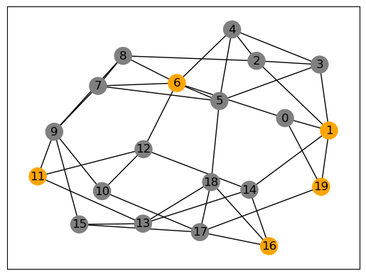
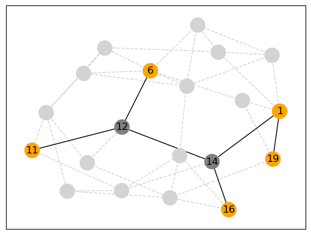
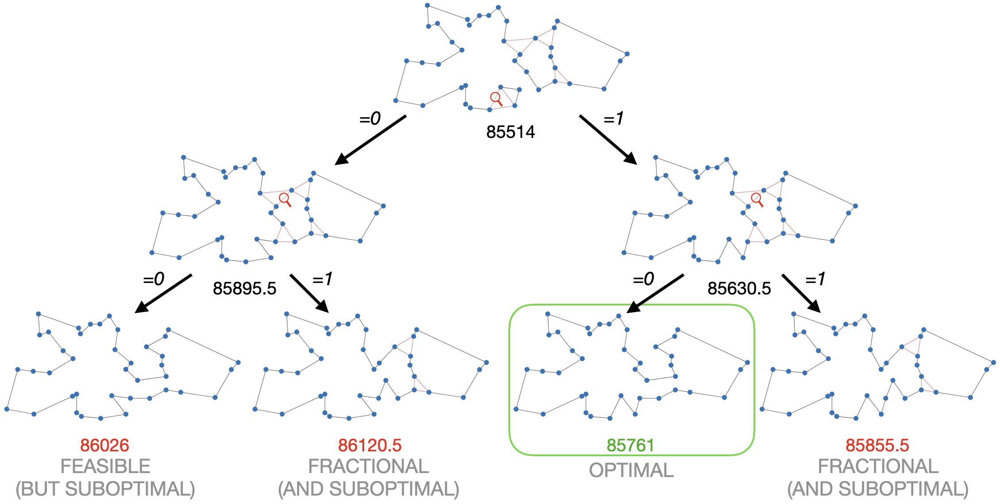

# Sheet 04: (Mixed) Integer (Linear) Programming

_Algorithms Lab Winter 2024/2025 - Dr. Dominik Krupke, TU Braunschweig, IBR,
Algorithms Group_

The oldest and most common technique for solving NP-hard optimization problems
in practice is
[(Mixed) Integer (Linear) Programming](https://en.wikipedia.org/wiki/Integer_programming).
It allows modeling problems using linear constraints and objective functions on
fractional and integral variables. Most combinatorial problems are easily
expressible by Mixed Integer Programming, and most practical optimization
problems can be sufficiently approximated. The probably most famous success
story of this technique is its usage by the
[TSP-solver Concorde](https://en.wikipedia.org/wiki/Concorde_TSP_Solver), which
was able to solve a (non-trivial) instance with over 85000 vertices to
optimality. The solvers are usually based on
[Branch&Bound](https://en.wikipedia.org/wiki/Branch_and_bound),
[Linear Relaxation](https://en.wikipedia.org/wiki/Linear_programming_relaxation),
and [Cutting Planes](https://en.wikipedia.org/wiki/Cutting-plane_method), of
which especially the last two have a serious mathematical foundation. Mixed
Integer Programming is one of the prime examples for the importance of
theoretical research for practical progress. However, you don't have to worry
about any mathematical details, as modern solvers will do most of the
complicated stuff for you. This
[primer](https://www.gurobi.com/resources/mixed-integer-programming-mip-a-primer-on-the-basics/)
gives you some further details on how it is working. We will focus here on just
modeling the problems and using such a solver as a black box.

## Modeling

Modern MIP-solvers like Gurobi have a very expressive API that allows a
declarative usage, similar to CP-SAT. The main differences are that MIP-solvers
are usually limited to linear expressions (everything non-linear is usually done
by inefficient tricks) but can deal much better with fractional values. An
advanced concept are also lazy constraints, that allow to efficiently add
further constraints via callbacks. In the previous sheet, we already used
iterative model building to only add constraints if necessary. With MIP-solvers
this is more interactive. Linear expressions are algebraic formulas of the first
degree, i.e., variables are not multiplied or divided by each other (or
themselves). As comparisons, only $\leq, =, \geq$ are allowed, but not true
inequalities, making them essentially half-planes or spaces in a
high-dimensional spaces (and the solution space linear). An example for a linear
constraint is $4\cdot x_1-3 \cdot x_2+0.5\cdot x_3 \geq 7.3$.

$x_1^2 \leq 3$ would _not_ be linear as $x_1$ is multiplied by itself. Advanced
functions such as $\sin x$ are of course completely forbidden (though, there are
tricks to approximate them).

In a Mixed Integer Program, we have

1. Variables, which can be fractional, boolean, or integral. Fractional and
   integral variables can additionally have a lower and upper bound (as opposed
   to CP-SAT, where bounds were mandatory).
2. A linear objective function that is to be minimized or maximized.
3. A set of linear constraints on the variables that have to be satisfied by
   every solution.
4. Optionally, a lazy constraints-function that gets a solution and returns
   nothing if the solution is feasible or returns constraints that are violated
   and should be added to the set. This allows to have a theoretically huge
   number of constraints in the model, but not in the computer memory.

You can also check out these
[video lectures](https://www.gurobi.com/resource/tutorial-mixed-integer-linear-programming/).

## Installation

We will use [Gurobi](https://www.gurobi.com/). In case you haven't already
installed it, you can do so using [Anaconda](https://www.anaconda.com/download)

```bash
conda config --add channels http://conda.anaconda.org/gurobi
conda install gurobi
```

You can also install it via `pip`, but this may not install the license tool
`grbgetkey`, which is required for activating a full academic license. Without
such a license, only very small models and only a subset of the API can be used.
For getting such an academic license, you have to
[register](https://www.gurobi.com/academia/academic-program-and-licenses/). In
the past, this page has been buggy from time to time (e.g., it forgot your
student status).

Once you got a license from the webpage, you can run

```bash
grbgetkey XXXXXXXX-YOUR-KEY-XXXXXXXXXX
```

to activate it. You may have to be within the university's network (or use VPN)
for this.

> [!CAUTION]
>
> Make sure to perform and test the installation early, as this is a common
> source of problems, and we are not able to provide last-minute support.

## Basic Usage

```python
import gurobipy as gp  # API
from gurobipy import GRB  # Symbols (e.g. GRB.BINARY)

model = gp.Model("mip1")  # Create a model
model.Params.TimeLimit = 90  # 90s time limit

# Create variables x (bool), y (integer), z (fractional)
x = model.addVar(vtype=GRB.BINARY, name="x")
y = model.addVar(vtype=GRB.INTEGER, name="y", lb=-GRB.INFINITY)
z = model.addVar(vtype=GRB.CONTINUOUS, name="z")
# further options:
# * lb: float <= Lower Bound: Default Zero!!!
# * ub: float <= Upper Bound
# * obj: float <= Coefficient for the objective function.

# Objective function (Maximization)
model.setObjective(x + y + 2 * z, GRB.MAXIMIZE)

# Constraints
model.addConstr(x + 2 * y + 3 * z <= 4, name="Constraint1")
model.addConstr(x + y >= 1, name="Constraint2")

# AND GO!
model.optimize()
```

This will give us the following log.

```
 Gurobi Optimizer version 9.1.2 build v9.1.2rc0 (mac64)
Thread count: 4 physical cores, 8 logical processors, using up to 8 threads
Optimize a model with 2 rows, 3 columns and 5 nonzeros
Model fingerprint: 0xd685009c
Model has 1 quadratic objective term
Variable types: 1 continuous, 2 integer (1 binary)
Coefficient statistics:
  Matrix range     [1e+00, 3e+00]
  Objective range  [1e+00, 2e+00]
  QObjective range [2e+00, 2e+00]
  Bounds range     [1e+00, 1e+00]
  RHS range        [1e+00, 4e+00]
Found heuristic solution: objective 1.0000000
Presolve removed 2 rows and 3 columns
Presolve time: 0.00s
Presolve: All rows and columns removed

Explored 0 nodes (0 simplex iterations) in 0.01 seconds
Thread count was 1 (of 8 available processors)

Solution count 2: 3 1

Optimal solution found (tolerance 1.00e-04)
Best objective 3.000000000000e+00, best bound 3.000000000000e+00, gap 0.0000%
```

The log shows that the solver found a solution of value 3.0, which is optimal
(as there is a matching bound and the gap is 0%). We can access the solution as
follows:

```python
if model.Status == GRB.OPTIMAL:  # an optimal solution has been found
    print("=== Optimal Solution ===")
    print(f"x={x.X}")
    print(f"y={y.X}")
    print(f"z={z.X}")
elif model.SolCount > 0:  # there exists a feasible solution
    print("=== Suboptimal Solution ===")
    print(f"x={x.X}")
    print(f"y={y.X}")
    print(f"z={z.X}")
else:
    print(f"Bad solution (code {model.Status}).")
    print(
        "See status codes on https://www.gurobi.com/documentation/9.5/refman/optimization_status_codes.html#sec:StatusCodes"
    )
```

> [!WARNING]
>
> Due to the underlying technique, the resulting variables may not be rounded. A
> boolean variable could take the value 0.00001 instead of 0, so you have to
> round to check them.

## Example: Steiner Tree in Graphs

The Steiner Tree Problem is a generalization of the Minimum Spanning Tree
Problem. Given a graph $G=(V,E)$ with edge weights $c_e\in \mathbb{R}^+$ and a
set of terminal vertices $T\subseteq V$, the goal is to find a minimum weight
tree that connects all vertices in $T$. For simplicity, we assume uniform edge
weights, i.e., $c_e=1$ for all $e\in E$. This simplification is still NP-hard.
The following figure shows an instance of the Steiner Tree Problem and a
solution.

|                                                            |  |
| :------------------------------------------------------------------------------------------------------------: | :--------------------------------------------------: |
| _An instance of the Steiner Tree Problem. The terminals are marked in orange. We assume uniform edge weights._ |            _A solution for the instance._            |

The problem is NP-hard, but can be solved reasonably well using MIP. We will use
the following model:

#### Parameters:

- $G = (V, E)$: A graph with vertices $V$ and edges $E$.
- A cost $c_e\geq 0$ associated with each edge $e\in E$.
- A set of terminal vertices $T\subseteq V$. We assume that $T$ is non-empty.

#### Decision Variables:

- $x_e \in \mathbb{B}, \quad \forall e\in E$ A variable that indicates if the
  edge is part of the tree or not.

#### Objective:

Minimize the total weight of the tree

$$
\sum_{e\in E} c_e \cdot x_e
$$

#### Constraints:

1. **Connectivity** For every subset of vertices $S\subseteq V$ with
   $S\cap T\neq \emptyset$ but $T\not\subseteq S$ we have to ensure that there
   is a path from $S\cap T$ to $S\setminus T$.
   - $\sum_{e\in \delta(S)} x_e \geq 1 \quad \forall S\subseteq V: S\cap T\neq \emptyset \wedge T\not\subseteq S$
2. **Tree** The constraint above only enforces a connected component and not a
   tree. However, every minimal connected component will be a tree, thus, this
   is enforced by the objective function and does not require an explicit
   constraint. However, if the returned solution is suboptimal, redundant edges
   may have to be removed.

### Lazy Constraints

You may have noticed that this requires an exponential number of constraints,
which would not be efficient. However, we can add them lazily, i.e., only if
needed. This is done by writing a callback function that will be called for
every solution found by the solver. In this callback function, we are asked if
we want to add any further constraints, or if we accept the solution. This is a
powerful concept that allows us to build complex models with many constraints,
as long as we are efficiently able to efficiently find violated constraints.

### Implementation

Let us first implement an instance container. Using a networkx graph as input
allows us to use all the graph functionality that networkx provides.

```python
import networkx as nx
import gurobipy as gp
from gurobipy import GRB


class Instance:
    """
    Unweighted Steiner Tree Instance
    -------------------------------
    This class represents an instance, consisting of a graph, and
    the list of terminals that have to be connected with as few edges
    as possible.
    """

    def __init__(self, graph: nx.Graph, terminals: list) -> None:
        self.graph = graph
        self.terminals = terminals
        assert all(t in self.graph.nodes() for t in self.terminals)
```

Next, we create a container for the variables that allow us easy access to the
variables and subsets of them. Such a container, e.g., allows you to deal with
the property that $x_{(u,v)}=x_{(v,u)}$.

```python
class _EdgeVariables:
    """
    A helper class that manages the variables for the edges.
    Such a helper class turns out to be useful in many cases.
    """

    def __init__(self, G: nx.Graph, model: gp.Model):
        self._graph = G
        self._model = model
        self._vars = {
            (u, v): model.addVar(vtype=gp.GRB.BINARY, name=f"edge_{u}_{v}")
            for u, v in G.edges
        }

    def x(self, v, w) -> gp.Var:
        """
        Return variable for edge (v, w).
        """
        if (v, w) in self._vars:
            return self._vars[v, w]
        # If (v,w) was not found, try (w,v)
        return self._vars[w, v]

    def outgoing_edges(self, vertices):
        """
        Return all edges&variables that are outgoing from the given vertices.
        """
        # Not super efficient, but efficient enough for our purposes.
        for (v, w), x in self._vars.items():
            if v in vertices and w not in vertices:
                yield (v, w), x
            elif w in vertices and v not in vertices:
                yield (w, v), x

    def incident_edges(self, v):
        """
        Return all edges&variables that are incident to the given vertex.
        """
        for n in self._graph.neighbors(v):
            yield (v, n), self.x(v, n)

    def __iter__(self):
        """
        Iterate over all edges&variables.
        """
        return iter(self._vars.items())

    def as_graph(self, in_callback: bool = False):
        """
        Return the current solution as a graph.
        """
        if in_callback:
            # If we are in a callback, we need to use the solution from the callback.
            used_edges = [vw for vw, x in self if self._model.cbGetSolution(x) > 0.5]
        else:
            # Otherwise, we can use the solution from the model.
            used_edges = [vw for vw, x in self if x.X > 0.5]
        return nx.Graph(used_edges)
```

Next, we implement the model itself. An important detail is that we need to
access the current solution differently depending on whether we are in a
callback or not. In a callback, we need to use `self._model.cbGetSolution(x)` to
get the current solution, while outside of a callback, we can use `x.X`.

```python
class SteinerTreeSolver:
    """
    A simple solver for the Unweighted Steiner Tree problem.
    """

    def __init__(self, instance: Instance) -> None:
        self.instance = instance
        self.model = gp.Model()
        self._edge_vars = _EdgeVariables(self.instance.graph, self.model)
        self._enforce_outgoing_edge_for_every_terminal()
        self._minimize_edges()

    def _enforce_outgoing_edge_for_every_terminal(self):
        if len(self.instance.terminals) <= 1:
            # Trivial instance, no need to add constraints
            return
        for t in self.instance.terminals:
            self.model.addConstr(
                gp.quicksum(x for _, x in self._edge_vars.incident_edges(t)) >= 1
            )

    def _minimize_edges(self):
        self.model.setObjective(sum(x for _, x in self._edge_vars), GRB.MINIMIZE)

    def lower_bound(self):
        """
        Return the current lower bound.
        """
        # Only works if the model has been optimized once.
        return self.model.ObjBound

    def solve(self, time_limit: float = 900, opt_tol: float = 0.0001):
        self.model.Params.TimeLimit = time_limit  # Limit the runtime
        self.model.Params.MIPGap = opt_tol  # Allowing a small optimality gap
        self.model.Params.NonConvex = 0  # Throw an error if the model is non-convex

        def callback(model, where):
            # This callback is called by Gurobi on various occasions, and
            # we can react to these occasions.
            if where == gp.GRB.Callback.MIPSOL:
                # We are in a new MIP solution. We can query the solution
                # and add additional constraints, if we want to.
                # We are going to enforce a leaving edge for every component
                # that contains only a part of the terminals.
                solution = self._edge_vars.as_graph(in_callback=True)
                comps = list(nx.connected_components(solution))
                if len(comps) == 1:
                    return  # solution is connected
                terminals = set(self.instance.terminals)
                for comp in comps:
                    terms_in_comp = terminals & comp
                    if not terms_in_comp:
                        continue  # the objective will remove this component by itself
                    if terms_in_comp != terminals:
                        # we have a component that contains some terminals but not all
                        # -> we need to add a constraint
                        model.cbLazy(
                            sum(x for _, x in self._edge_vars.outgoing_edges(comp)) >= 1
                        )

        self.model.Params.LazyConstraints = 1  # enable lazy constraints
        self.model.optimize(callback)  # pass the callback with the `solve` call
        _check_linear(self.model)
        if self.model.status == GRB.OPTIMAL:
            return self._edge_vars.as_graph()
        if self.model.SolCount > 0:
            # If the solution is not optimal, it may not be a tree. Apply DFS to get a tree.
            return nx.dfs_tree(self._edge_vars.as_graph())
        return None
```

You can find the full code in the file
[./examples/steiner_tree/solver.py](./examples/steiner_tree/solver.py). A
notebook with an example usage can be found in
[./examples/steiner_tree/steiner.ipynb](./examples/steiner_tree/steiner.ipynb).

## Some Modeling Techniques

This section will introduce basic modeling techniques that you might find
helpful for your exercises.

> [!WARNING]
>
> Gurobi can actually also solve non-linear problems, and in the past, we have
> seen students use these features as this can simplify the modeling. However,
> you should stick to purely linear constraints and objective functions, as they
> are much more efficient. If your model does not perform well and time out for
> the larger tests, it is likely that you have accidentally used a non-linear
> constraint or objective function.

### Logical Constraints

Gurobi does not directly accept logical constraints such as AND, OR, NOT, or
IMPLICATION. However, you can easily model these using linear constraints.

```python
model = gp.Model()
x = model.addVar(vtype=GRB.BINARY, name="x")
y = model.addVar(vtype=GRB.BINARY, name="y")
z = model.addVar(vtype=GRB.BINARY, name="z")

# OR (AT LEAST ONE)
model.addConstr(x + y + z >= 1)

# AT LEAST TWO
model.addConstr(x + y + z >= 2)

# NEGATION (x OR y OR NOT z)
model.addConstr(x + y + (1 - z) >= 1)

# IMPLICATION (x IMPLIES y)
model.addConstr(x <= y)

# IMPLICATION (x IMPLIES NOT y)
model.addConstr(x <= 1 - y)

# IMPLICATION (x AND y IMPLIES z)
model.addConstr(x + y <= 2 * z)
```

### Forcing a Variable to Zero Under Certain Conditions

At times, you might need to set a variable to zero based on the state of another
variable. For example, using a resource might be contingent on a specific
condition being met.

```python
model = gp.Model()

use_resource1 = model.addVar(vtype=GRB.BINARY, name="use_resource1")
use_resource2 = model.addVar(vtype=GRB.BINARY, name="use_resource2")
lb = -10  # Lower bound for the resources
ub = 10  # Upper bound for the resources
resource1 = model.addVar(vtype=GRB.CONTINUOUS, name="resource1", lb=lb, ub=ub)
resource2 = model.addVar(vtype=GRB.CONTINUOUS, name="resource2", lb=lb, ub=ub)

# Ensuring resource1 is zero if use_resource1 is zero
model.addConstr(resource1 <= ub * use_resource1)
model.addConstr(resource1 >= lb * use_resource1)

# Ensuring resource2 is zero if use_resource2 is zero
model.addConstr(resource2 <= ub * use_resource2)
model.addConstr(resource2 >= lb * use_resource2)

# Ensuring that only one resource can be used at a time
model.addConstr(use_resource1 + use_resource2 <= 1)
```

### Big-M Constraints

Big-M constraints are a common technique in mathematical modeling to represent
logical conditions. This approach introduces a large constant, $M$, into the
model, allowing constraints to be conditionally enforced based on the value of a
binary variable.

#### How Big-M Constraints Work

The principle is straightforward:

- When the binary variable is 0, the presence of $M$ ensures that the constraint
  is rendered non-restrictive.
- When the binary variable is 1, the constraint becomes active, directly
  influencing the solution.

#### Selecting the Value of $M$

Choosing an appropriate value for $M$ is critical.

- **Too large:** A value of $M$ that is excessively high can lead to numerical
  instability and may unnecessarily complicate the solution process.
- **Too small:** An inadequate $M$ may cause the constraint to be invalid for
  certain feasible solutions.

To maintain efficiency and solvability, it is best to minimize the use of Big-M
constraints and select the smallest effective value for $M$.

#### Example: Implementing a Big-M Constraint

Below is a Python example illustrating the use of a Big-M constraint in a Gurobi
model:

```python
import gurobipy as gp
from gurobipy import GRB

# Create a model
model = gp.Model()

# Add variables
x = model.addVar(vtype=GRB.BINARY, name="x")
y = model.addVar(vtype=GRB.CONTINUOUS, name="y", ub=100)
z = model.addVar(vtype=GRB.CONTINUOUS, name="z", ub=100)

# Define a Big-M constraint:
# 10*y + 20*z <= 1000 is enforced only if x == 1
M = 10 * 100 + 20 * 100  # Compute M based on the upper bounds of y and z
model.addConstr(10 * y + 20 * z <= 1000 + M * (1 - x))
```

In this example, the constraint $10y + 20z \leq 1000$ is enforced only when
$x = 1$. If $x = 0$, the addition of $M$ ensures the inequality is trivially
satisfied, effectively disabling the constraint.

#### Challenges of Big-M Constraints

Consider a solution where $y = 1$ and $z = 50$, resulting in $10y + 20z = 1010$.
For this solution to be feasible, $x = 1$ is required. However, in the linear
relaxation, a fractional value like $x = 0.004$ could suffice to satisfy the
constraint because $M$ is so large. This discrepancy undermines the intended
logic of the model.

While a mixed integer programming (MIP) solver can resolve such issues, relying
heavily on Big-M constraints with overly large values can degrade the quality of
the linear relaxation, which is a core component of the solver. Efficient
modeling aims to minimize the use of large $M$ values to reduce unnecessary
computational overhead and ensure numerical stability. If your model involves a
significant amount of such logical constraints, alternative approaches like
CP-SAT may offer better efficiency, as CP-SAT relies less on the linear
relaxation compared to traditional MIP solvers.

## Linear Relaxation and its Importance in MIP Solving

Linear Relaxation plays a pivotal role in solving Mixed Integer Programs (MIPs).
This technique is particularly effective when MIPs involve only fractional
variables, transforming them into Linear Programs (LPs). The advantage of LPs
lies in their solvability within polynomial time, making them an efficient tool
within a branch-and-bound algorithm framework.

The process involves converting all boolean and integral variables in a MIP to
fractional counterparts, resulting in an LP, known as Linear Relaxation. If this
LP yields an integral solution, the problem is solved. If not, the algorithm
branches on one of the fractional variables.

The effectiveness of Linear Relaxation significantly influences the overall
performance of the MIP. A Linear Relaxation that approximates the optimal
solution closely can dramatically speed up the branch-and-bound process. Many
problems exhibit this characteristic, contributing to the high success rate of
MIP solvers.

Consider the branch-and-bound tree for the Traveling Salesman Problem (TSP) as
an example. At the root of this tree lies the Linear Relaxation of the TSP,
characterized by some fractionally chosen edges. When we branch on an edge
(indicated by a red lens), it creates two subproblems: one where the edge is
included and one where it's excluded. Each subproblem often leads to fractional
solutions, necessitating further branching. Interestingly, in this example, the
optimal solution emerges at the second level. It is integral, meaning all edges
are either fully chosen or not, and it offers the lowest cost among all the
leaves of the tree. While there may be other fractional solutions that we could
branch on, they can be pruned if they are less optimal than the found solution.
This example underscores the efficiency and effectiveness of the
branch-and-bound method, also highlighting the proximity of Linear Relaxation to
the optimal solution.

|                                                                                     |
| :-----------------------------------------------------------------------------------------------------------------------------------------: |
| _This example was generated using the DIY TSP Solver by Bill Cook. [Play around with it!](https://www.math.uwaterloo.ca/tsp/D3/bootQ.html)_ |

## Exercises

- [Traveling Salesman Problem (TSP)](./exercises/01_tsp/): The Traveling
  Salesman Problem is a foundational exercise that every optimization student
  should encounter. Its historical significance is matched by its practical
  relevance and its role as a classic example of the power of mixed integer
  programming (MIP) solvers. While you have explored various cycle and
  tour-related problems in previous exercises, TSP is the most fundamental among
  them. Its linear relaxation is typically very strong, making MIP a
  particularly effective approach for solving it.
- [Flow Problems](./exercises/02_flow/): Flow problems represent another
  critical class of optimization problems, with applications ranging from
  logistics to energy networks. While certain variants of flow problems can be
  solved efficiently and will be covered in the network algorithms lecture,
  adding even a few additional constraints can make them significantly more
  challenging. Fortunately, mixed integer programming often works well for these
  problems, even for large instances.
