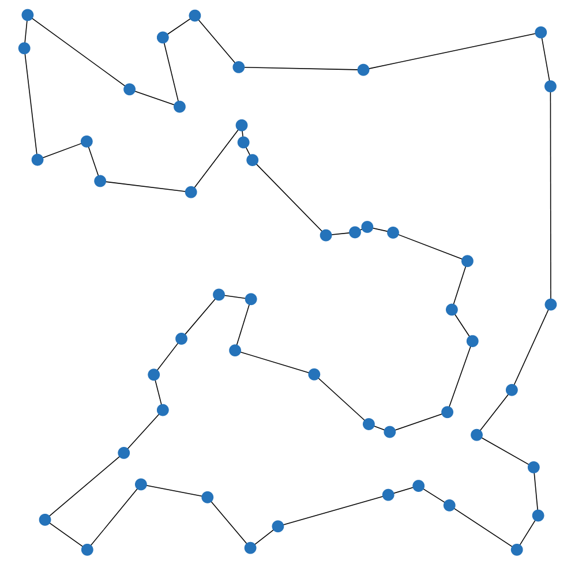
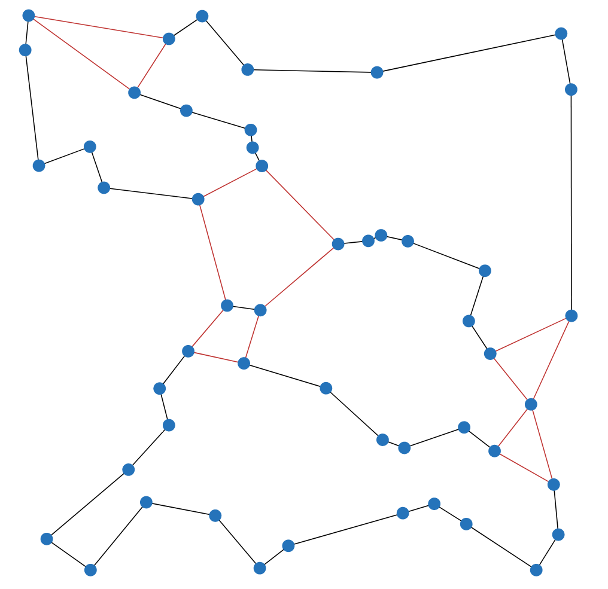
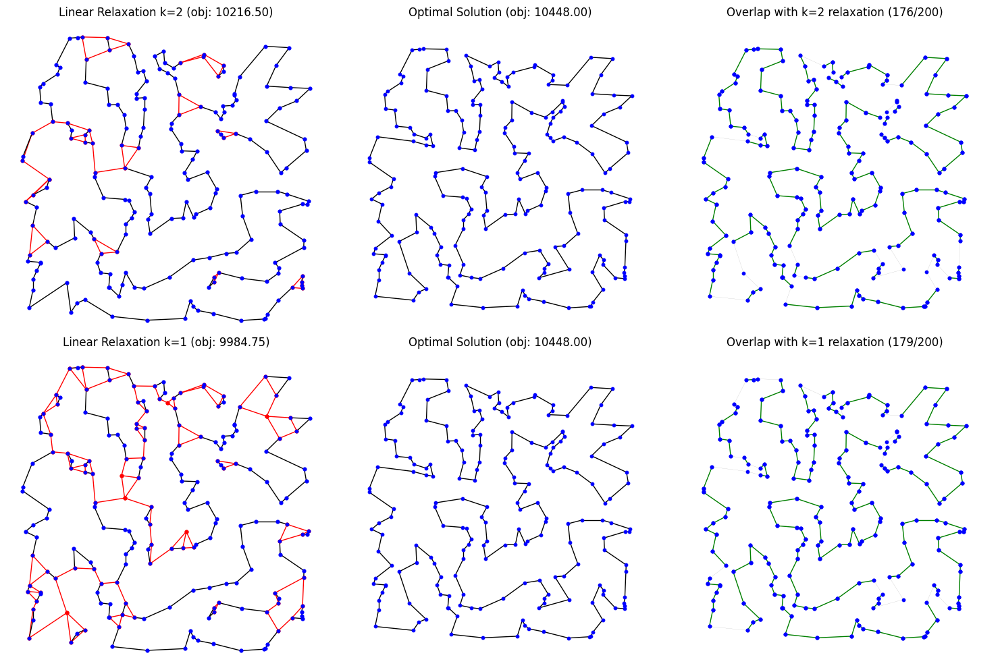

# Exercise: Implementing and Analyzing the Dantzig-Fulkerson-Johnson Formulation for TSP


By now, you have gained some experience in designing optimization algorithms,
but you have yet to address one of the most famous optimization problems: the
Traveling Salesman Problem (TSP). Tackling this problem at least once is
essential for anyone aspiring to call themselves an optimization engineer.

The TSP is a classic combinatorial optimization problem that seeks the shortest
possible tour that visits a set of cities exactly once and returns to the
starting point. As an NP-hard problem, there is no known polynomial-time
algorithm to solve it exactly. Nevertheless, we will rise to the challenge and
leverage the power of Mixed Integer Programming (MIP) to address it.

In practice, when confronted with the basic TSP, the most efficient approach is
to use a specialized solver such as
[Concorde](http://www.math.uwaterloo.ca/tsp/concorde.html). Despite its age,
Concorde remains the state-of-the-art solver, packed with optimizations that
outperform any quick MIP formulation. However, the real value of a MIP-based
approach lies in its flexibility. Many practical problems are variations of the
TSP, and for these cases, the model we will develop here provides an excellent
foundation.

## Dantzig-Fulkerson-Johnson Formulation

The Dantzig-Fulkerson-Johnson (DFJ) formulation is a foundational mathematical
model for the Traveling Salesman Problem (TSP). It is particularly effective for
representing the problem in the framework of Mixed Integer Programming. This
formulation uses binary decision variables to indicate the inclusion of edges in
the tour and incorporates constraints to enforce the structural properties of a
valid solution, such as degree conditions and subtour elimination. This model is
also used internally by Concorde.

> [!NOTE]
>
> If you are interested, you can find an overview of different (A)TSP
> formulations
> [in this paper](https://mate.unipv.it/~gualandi/famo2conti/papers/tsp_formulations.pdf).
> Check also the video
> [Optimal Tours: The Travelings Salesman Problem by Bill Cook](https://www.youtube.com/watch?v=tChnXG6ulyE)
> for an easy introduction into solving the TSP. There is also the
> beginner-friendly book
> [In Pursuit of the Traveling Salesman: Mathematics at the Limits of Computation](https://press.princeton.edu/books/paperback/9780691163529/in-pursuit-of-the-traveling-salesman)
> by William Cook or the more advanced
> [The Traveling Salesman Problem: A Computational Study](https://press.princeton.edu/books/hardcover/9780691129938/the-traveling-salesman-problem)
> by David Applegate, Robert Bixby, Vasek Chvatal, and William Cook.

### Parameters:

- $G = (V, E)$: A graph with vertices $V$ and edges $E$, where every pair of
  vertices is connected by an edge.
- $c_e, e\in E$: The cost of edge $e \in E$.
- $\delta(v), v\in V$: The set of edges incident to vertex $v$.

### Decision Variables:

- $x_e \in \{0, 1\} \quad \forall e \in E$: Binary variables indicating whether
  edge $e$ is part of the tour.

### Objective:

Minimize the total cost of the tour.

$$\min \quad \sum_{e\in E} c_e\cdot x_e$$

### Constraints:

1. **Degree Constraints:** Each vertex $v \in V$ must have exactly two incident
   edges.

   $$\sum_{e \in \delta(v)} x_e = 2 \quad \forall v \in V$$

2. **Subtour Elimination Constraints:** For each subset $S \subseteq V$ with
   $|S| \geq 2$, ensure there are at least two edges exiting the subset.

   $$\sum_{e \in \delta(S)} x_e \geq 2 \quad \forall S \subsetneq V, S \neq \emptyset$$

> [!IMPORTANT]
>
> Because there is an exponential number of subsets $S$, the subtour elimination
> constraints are typically added iteratively as needed. This is often done
> using a callback function in the solver, which adds constraints when a subtour
> is detected in the current solution. Check out the example in the introduction
> to see how this can be implemented.

## Tasks

### A. Implement a TSP Solver in Gurobi

1. Implement a TSP Solver using above's formulation and Lazy Constraints with
   Gurobi in `solution_dantzig.py`.
2. Verify your implementation by running `python3 verify_dantzig.py` in the
   terminal. While some instances can take a few seconds, all instances should
   be solvable even on a cheap notebook.

> [!IMPORTANT]
>
> Even for boolean and integer variables, Gurobi will often return slightly
> fractional values. This is due to the solver's internal algorithms and does
> not indicate an error. To work with these values, you can either round them to
> the nearest integer or use a threshold, e.g., $x_e \geq 0.5$ to determine if
> an edge is part of the tour.

> [!TIP]
>
> You can use NetworkX's `connected_components` to find subtours.

---

### B. Linear Relaxation

> [!WARNING]
>
> Before proceeding, ensure that you have a solid understanding of what a
> [linear relaxation](https://en.wikipedia.org/wiki/Linear_programming_relaxation)
> is. Misunderstanding this concept has often led students to implement
> incorrect solvers, turning a straightforward exercise into an unnecessarily
> challenging task.

1. Implement a linear relaxation for the TSP formulation using Gurobi in
   `solution_relaxation.py`. Make sure you have understood what a linear
   relaxation is before you start. Given the previous task, it should be a very
   small step to implement the linear relaxation.
2. When implementing the DFJ for a SAT-solver, we used `>=1` for the subtour
   elimination constraints, which is sufficient for correctness and allowed us
   to model it via a simple clause. For MIP solvers, using `>=2` is typically
   more efficient because it leads to a stronger linear relaxation. We will try
   to analyze that ourselves, so the solver class has a parameter `k` that you
   should use to set the subtour elimination constraints.
3. Verify your implementation by running `python3 verify_relaxation.py` in the
   terminal. All instances should be solved very quickly.

> [!NOTE]
>
> The instance will be given as networkx graph, with edge weights as attribute
> `weight`.

> [!IMPORTANT]
>
> You do not need to use lazy constraints; instead, you should perform multiple
> iterations and add constraints as needed. The `MIPSOL` callback will not work
> because it is only called after the MIP solver has found a feasible solution
> during the branch-and-bound search. However, the linear relaxation is a linear
> program and can be solved directly without the branch-and-bound search, thus
> not triggering any `MIPSOL` events. Iterate on the same model such that Gurobi
> can exploit the previous solution and speed up the solving process.

> [!IMPORTANT]
>
> Assume an edge to be used in the tour if $x_e \geq 0.01$. Thus, in your
> solution, the graph should be connected by edges with $x_e \geq 0.01$. You can
> use NetworkX's `connected_components` to find subtours on this graph in order
> to add constraints.

> [!IMPORTANT]
>
> You may have to make sure, the constraint you add is actually violated, as you
> otherwise run into an infinite loop.

> [!TIP]
>
> You can copy a lot of code from the integral version.

<table>
   <tr>
      <td style="width: 50%;">
         
      </td>
      <td style="width: 50%;">
         
      </td>
   </tr>
   <tr>
      <td style="text-align: center;">
         An optimal integral solution for the TSP.
      </td>
      <td style="text-align: center;">
         <em>Linear Relaxation of the TSP. The red edges have fractional values, i.e., 0 &lt; x &lt; 1, most of the time x = 0.5. The linear relaxation is connected when applying the subtour elimination constraints on all edges with x &ge; &epsilon;.</em>
      </td>
   </tr>
</table>

---

### C. Experimental Analysis

Gurobi can compute optimal solutions for reasonable sized instances of the TSP
thanks to the similarity of the solutions to the efficiently computable linear
relaxation. In this task, you will analyze this similarity yourself.

1. Run the block
   ```python
   # Run me to get a sample on linear relaxation and integral solution
   get_sample()
   print(f"There are now {len(samples)} samples")
   ```
   in `evaluation.ipynb` multiple times to get a set of at least 20 pairs of
   linear relaxation and integral solutions.

   You should get a visualization like this:
   |  |
   |:--:|
   | Example of a comparison between the linear relaxations and the integral solution. |
   
2. Evaluate how close the linear relaxations are to the integral solution and
   how much difference the `>=2` makes. Remembering how the Branch and Bound
   algorithm works, how much time do you think can be saved by a good linear
   relaxation?

> [!NOTE]
>
> The strength of the linear relaxation is often a good indicator of how well a
> MIP solver will perform. You can often reinforce the linear relaxation by
> adding additional constraints that do not matter for the integral solution but
> will cut off some fractional solutions. This is a common technique in
> optimization, and you can find more information in the literature.

---

## References

- [Definition of Linear Relaxation on Wikipedia](https://en.wikipedia.org/wiki/Linear_programming_relaxation)
- [How do I install Gurobi for Python?](https://support.gurobi.com/hc/en-us/articles/360044290292-How-do-I-install-Gurobi-for-Python)
- [Tutorial: Getting Started with the Gurobi Python API](https://support.gurobi.com/hc/en-us/articles/17278438215313-Tutorial-Getting-Started-with-the-Gurobi-Python-API)
- [Mathematical Modelling](https://www.gurobi.com/resources/math-programming-modeling-basics/):
  A crash-course in mathematical modelling.\
- [networkx](https://networkx.org/documentation/stable/tutorial.html)
- [pre-commit](https://pre-commit.com/): We have set up a pre-commit
  configuration for you that you can use to quickly pretty up and check your
  code. You can install it by running `pip install pre-commit` and then
  `pre-commit run --all-files` to run it on all files in your repository.
- [DIY TSP Solver in the Browser](https://www.math.uwaterloo.ca/tsp/D3/bootQ.html)
- [Gurobi Model.cbLazy() Documentation](https://www.gurobi.com/documentation/current/refman/py_model_cblazy.html)
