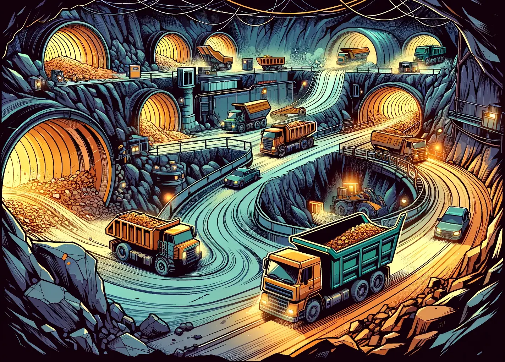

# Exercise: Flow Problems

As an aspiring expert in combinatorial optimization, word of your skills quickly
spreads to the Deep Earth Mining Consortium. There, Chief Engineer Terra seeks
your help. She is in the midst of organizing the transport network for mining
products for her underground mining facility and is facing difficult management
decisions. Due to recent geological activity, their fleet of ore trolleys has
repeatedly been interrupted due to cave-ins and collapses of underground
tunnels. Unfortunately, Chief Engineer Terra only has a limited budget for
shoring up the tunnels and reinforcing the structural integrity. Your task is to
help her decide which tunnels she should keep actively maintained by her team of
tunnel engineers during the current geological circumstances, such that the flow
of ores from the mines to the central processing facility is maximized.

More specific:

- In the Deep Earth Mining Complex, there are many different mining locations,
  where ores are mined. In addition, there is a single central elevator in the
  complex. There, the ores are transported to the surface for further processing
  steps.
- Every tunnel in the mining complex connects two locations. The tunnels are not
  inherently directional, but each tunnel only accommodates one rail, so traffic
  can only flow in one direction. (Deciding in which direction the traffic
  should flow along each tunnel is part of the problem).
- Ores are transported between locations using fleets of ore trolleys. These
  trolleys navigate through the network of underground tunnels. Due to
  individual tunnel properties, the throughput of ores on each tunnel $e \in E$
  is limited to at most $u_e \in \mathbb{N}$ units per hour.
- A mine $m \in M$, $M \subset V$ produces $o_m$ ores per hour. These ores can
  either be loaded onto ore trolleys arriving from other locations or onto new,
  empty trolleys. Due to the budget constraints, it is okay if some mined ores
  get left behind, or mines are not visited at all.
- A tunnel can only be used to transport ores if it gets reinforced and
  maintained. Otherwise, cave-ins and collapses could quickly disrupt the
  transport routes. Due to individual properties of the tunnels, maintenance
  costs $c_e \in \mathbb{R}$ for every tunnel $e \in E$ differ. The total
  maintenance cost per hour must not exceed Chief Engineer Terra's budget
  $b \in \mathbb{R}$.
- Chief Engineer Terra needs you to maximize the number of ores per hour that
  arrive at her central processing facility. To do so, decide which tunnels
  should be used, and how many ores shall be transported along each tunnel, such
  that the best possible ore flow to the elevator is created.

## Tasks

### Mathematical Modeling

1. Model the problem as a Mixed Integer Programming model. Do so using
   mathematical notation. What are the parameters? What are the variables? What
   are the constraints? What is the objective?
2. Is it possible to solve this problem using the two prior techniques CP-SAT,
   Card-SAT? What restrictions or changes would have to be made to the modeling
   and the solving procedure?

### Gurobi Implementation

1. Implement a MIP-based solver for this problem using Gurobi in the file
   [solution.py](./solution.py). The input and output data schemas are defined
   in [data_schema.py](./data_schema.py) using pydantic.
2. To verify your implementation, run `python3 verify.py` in the terminal. If
   your implementation is correct, you will see a success message. Otherwise,
   you will see an error message.

## References

- [How do I install Gurobi for Python?](https://support.gurobi.com/hc/en-us/articles/360044290292-How-do-I-install-Gurobi-for-Python)
- [Tutorial: Getting Started with the Gurobi Python API](https://support.gurobi.com/hc/en-us/articles/17278438215313-Tutorial-Getting-Started-with-the-Gurobi-Python-API)
- [Mathematical Modelling](https://www.gurobi.com/resources/math-programming-modeling-basics/):
  A crash-course in mathematical modelling.\
- [networkx](https://networkx.org/documentation/stable/tutorial.html)
- [pre-commit](https://pre-commit.com/): We have set up a pre-commit
  configuration for you that you can use to quickly pretty up and check your
  code. You can install it by running `pip install pre-commit` and then
  `pre-commit run --all-files` to run it on all files in your repository.
- [pydantic](https://docs.pydantic.dev/latest/): Make yourself familiar with the
  abilities of `pydantic` to ensure valid data. While there are many similar
  libraries, including Python's own `dataclasses`, `pydantic` is a very popular
  choice for data validation and serialization in industry.
